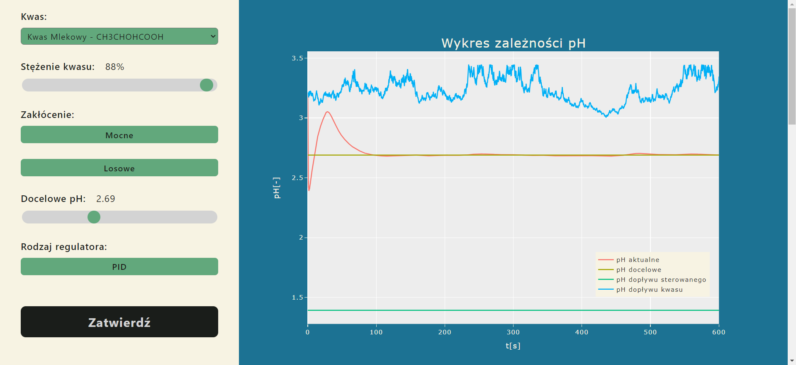

# pH Control Simulator Web App

Project made for Basics Of Control Engineering laboratories at Poznań University of Technology.

## General Information
Project is a simulator design that includes a container with two inlets and one outflow. One of the inlets, with a constant inflow rate, pours acid into the container with a measured, constant or fluctuating around a certain value concentration.
A second inlet pours into the containet the acid at a certain concentration, at a rate we cane regulate.
At the same time, the container is provided with an opening through which the acid in the container continuously flows out.
container. The acid is selected by the user from a choice of 10 available acids.
The simulator is designed to bring the solution in the container to the desired pH by adjusting the second acid inlet.<br /><br />
[Here](documentation/Sprawozdanie.pdf) You can find documentation which focuses mostly on formulas, calculation and scientific theory.<br /><br />
Project was made using [Flask](https://flask.palletsprojects.com/).<br />
Command to run program:
```bash
flask --app flaskr run --debug
```
## Repository content
* [acid.py](flaskr/acid.py) - introduces acid class with formulas and functions used when calculating results for chosen acid
* [load_json_to_plot.py](flaskr/load_json_to_plot.py) - creates plots from results using [plotly](https://plotly.com/python/)
* [__init__.py](flaskr/__init__.py) - launches app using python, [html](flaskr/templates/home.html) and [css](flaskr/static/styles.css) files
* [acids.json](flaskr/acids.json) - stores data about available acids<br /><br />


